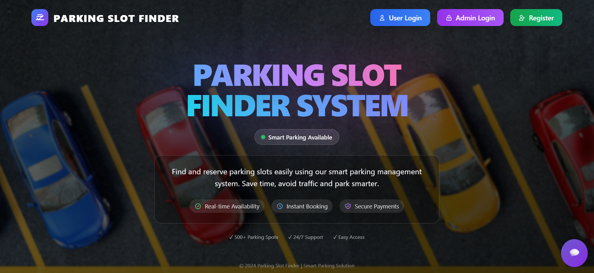
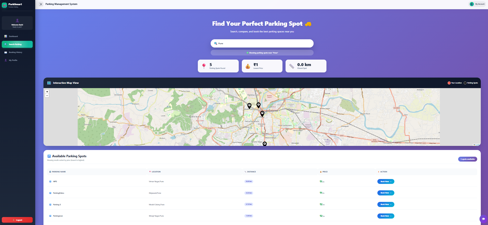
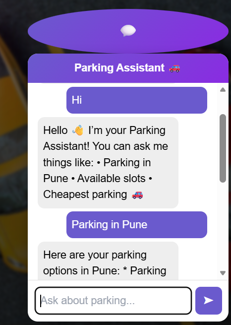
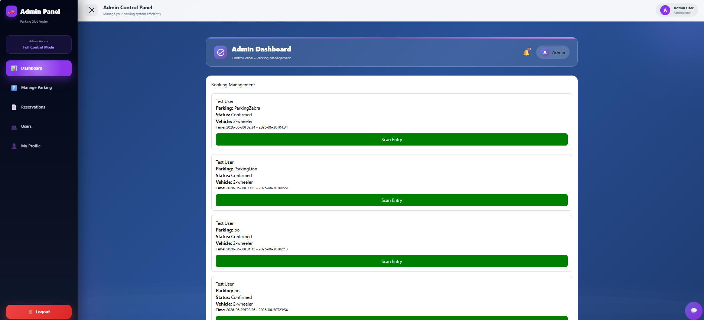
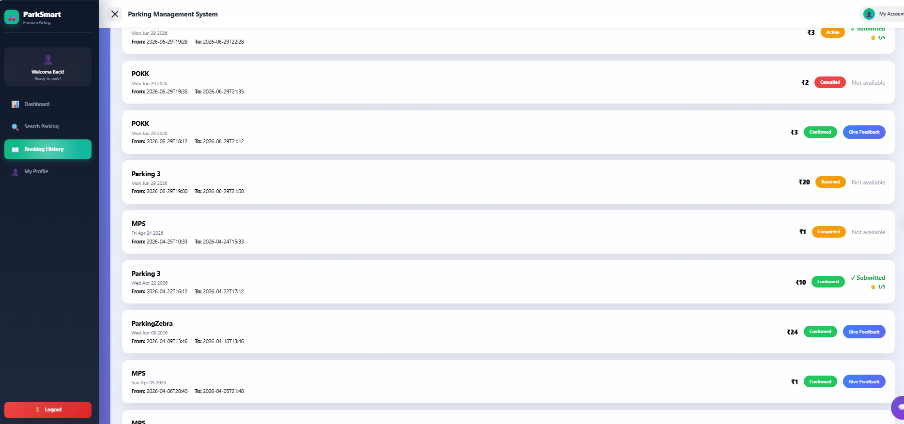
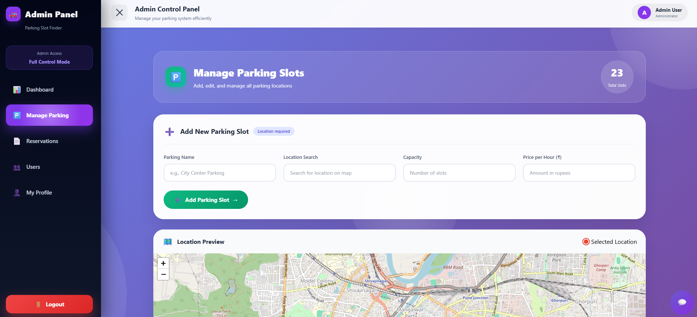
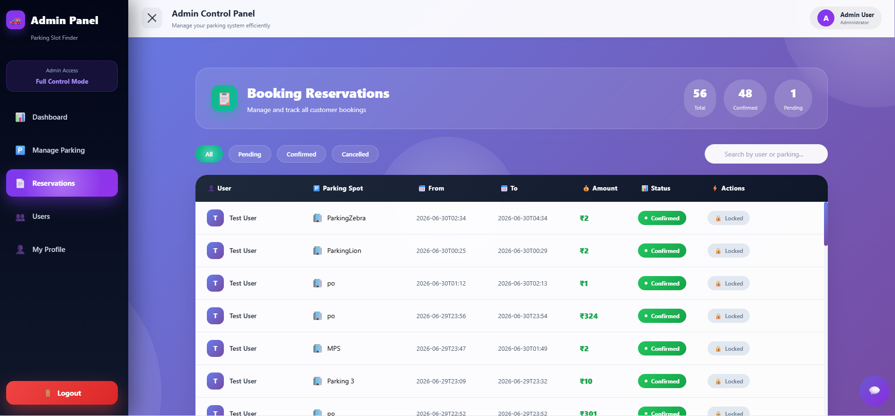

# 🚗 Parking Slot Finder 

> A modern MERN Stack based Smart Parking Management System that enables users to discover, reserve, and manage parking spaces with secure payments, AI assistance, QR-based access, PDF receipt generation, email notifications, interactive maps, and a powerful admin dashboard.

---

## 🚀 Live Demo

### 🌐 Live Application

https://parking-slot-finder-ruddy.vercel.app

### 💻 GitHub Repository

https://github.com/Janhvi7105/parking-slot-finder

---

## 📖 Project Overview

Parking Slot Finder is a full-stack MERN Stack web application designed to simplify urban parking management. Users can discover nearby parking spaces, reserve them online, make secure payments through Razorpay, receive PDF receipts via email, and access their reservations using QR code verification.

The platform also provides a comprehensive Admin Dashboard for managing parking slots, reservations, users, QR-based entry & exit, and overall parking operations in real time.

This project demonstrates practical experience in integrating multiple real-world technologies including payment gateways, AI, maps, PDF generation, QR codes, email automation, JWT authentication, and full-stack deployment.

---

## 💡 Why This Project?

Finding available parking in crowded cities is often frustrating and time-consuming.

Parking Slot Finder addresses this problem by providing a centralized platform where users can search nearby parking locations, reserve parking slots instantly, complete secure online payments, and access parking using QR-based verification.

The application combines modern web technologies with real-world business functionality to deliver a complete parking management solution.

---

## 🌟 Project Highlights

✔ Secure JWT Authentication

✔ Razorpay Payment Integration

✔ Google Gemini AI Assistant

✔ Interactive Parking Maps

✔ QR Code Based Entry & Exit

✔ PDF Receipt Generation

✔ Email Notifications using Brevo

✔ Comprehensive Admin Dashboard

---

## ⭐ Key Features Preview

| Home                      | Search Parking                      |
| ------------------------- | ----------------------------------- |
|  |  |

| AI Assistant                 | Admin Dashboard                      |
| ---------------------------- | ------------------------------------ |
|  |  |

| Booking History                      | Manage Parking                      |
| ------------------------------------ | ----------------------------------- |
|  |  |

---

## ✨ Features

### 👤 User Authentication

* User Registration
* Secure Login
* JWT Authentication
* Password Encryption (bcrypt)
* Profile Management

### 🚗 Smart Parking Reservation

* Search Nearby Parking Slots
* Interactive Map View
* Parking Availability
* Instant Reservation
* Vehicle Type Selection
* Real-Time Slot Availability
* Booking History

### 💳 Secure Online Payments

Powered by Razorpay

* Secure Payment Gateway
* Payment Verification
* Instant Booking Confirmation
* Protected Transactions

### 🗺️ Interactive Maps

* Leaflet Maps
* Parking Location Display
* Latitude & Longitude Support
* Location-Based Search

### 📄 PDF Receipt Generation

Automatically generated after successful booking.

Includes:

* Booking Details
* User Information
* Parking Details
* Booking Duration
* Payment Amount
* QR Code
* PDF Download

### 📧 Email Notifications

Powered by Brevo Email API.

Users automatically receive:

* Booking Confirmation
* PDF Receipt
* Booking Details

### 📱 QR Code Based Entry & Exit

Each booking generates a unique QR Code.

Admin can:

* Scan Entry
* Scan Exit
* Verify Booking
* Prevent Duplicate Entry

### 🤖 AI Parking Assistant

Powered by Google Gemini AI.

Supports:

* Parking Queries
* Booking Assistance
* Parking Suggestions
* General Information

### ⭐ Rating & Feedback

Users can:

* Submit Ratings
* Write Reviews
* Provide Feedback

Admin can monitor customer feedback.

### 👨‍💼 Admin Dashboard

Manage:

* Parking Slots
* Reservations
* Users
* QR Entry & Exit
* Feedback
* Dashboard Statistics

---

## ⚡ Key Technologies

| Category       | Technology           |
| -------------- | -------------------- |
| Frontend       | React.js             |
| Backend        | Node.js + Express.js |
| Database       | MongoDB Atlas        |
| Authentication | JWT + bcryptjs       |
| Payment        | Razorpay             |
| Maps           | Leaflet              |
| AI             | Google Gemini        |
| Email          | Brevo Email API      |
| PDF            | PDFKit               |
| QR Code        | QRCode               |
| Deployment     | Vercel + Render      |

---

## 🏗 Project Architecture

```text
parking-slot-finder
│
├── backend
│   ├── config
│   ├── controllers
│   ├── middleware
│   ├── models
│   ├── routes
│   ├── utils
│   ├── uploads
│   └── server.js
│
├── frontend
│   ├── public
│   ├── src
│   │   ├── components
│   │   ├── pages
│   │   ├── services
│   │   └── App.js
│
├── screenshots
├── README.md
└── package.json
```

---

## 🔄 Project Workflow

Register/Login

⬇

Search Nearby Parking

⬇

Choose Parking Slot

⬇

Select Date & Time

⬇

Secure Razorpay Payment

⬇

Booking Confirmed

⬇

PDF Receipt Generated

⬇

Email Notification Sent

⬇

QR Code Generated

⬇

Admin Scans Entry & Exit

---

## ⚙️ Installation

### Clone Repository

```bash
git clone https://github.com/Janhvi7105/parking-slot-finder.git

cd parking-slot-finder
```

### Backend

```bash
cd backend

npm install
```

Create `.env`

```env
PORT=5000

MONGO_URI=YOUR_MONGO_URI

JWT_SECRET=YOUR_SECRET

RAZORPAY_KEY_ID=YOUR_KEY

RAZORPAY_KEY_SECRET=YOUR_SECRET

BREVO_API_KEY=YOUR_API_KEY

EMAIL_FROM=YOUR_EMAIL

GEMINI_API_KEY=YOUR_API_KEY
```

Run backend

```bash
npm run dev
```

### Frontend

```bash
cd frontend

npm install

npm start
```

---

## 🌐 Deployment

| Service  | Platform      |
| -------- | ------------- |
| Frontend | Vercel        |
| Backend  | Render        |
| Database | MongoDB Atlas |
| Payment  | Razorpay      |
| Email    | Brevo         |
| AI       | Google Gemini |

---

## 📸 Application Preview

Below are screenshots showcasing the major features of the application.

### 🏠 Home


---

### 👤 User Dashboard


---

### 🗺️ Search Parking


---

### 📖 Booking History


---

### 🤖 AI Assistant


---

### 👨‍💼 Admin Dashboard


---

### 🅿️ Manage Parking


---

### 📋 Reservations



---

## 📖 How to Use

1. Register or Login.
2. Search nearby parking spaces.
3. Select your preferred parking location.
4. Choose booking date and time.
5. Complete payment using Razorpay.
6. Receive booking confirmation.
7. Download PDF receipt.
8. Receive confirmation email.
9. Use QR Code for parking entry & exit.

---

## 📌 Learning Outcomes

This project demonstrates practical experience in:

* MERN Stack Development
* REST API Development
* MongoDB Integration
* JWT Authentication
* Razorpay Integration
* Google Gemini AI Integration
* QR Code Generation
* PDF Generation
* Email Automation using Brevo
* Interactive Maps
* Admin Dashboard Development
* Responsive UI Design
* Environment Variable Management
* Full-Stack Deployment

---

## 🚀 Future Enhancements

* Live Parking Availability
* GPS Navigation
* Mobile Application
* Multi-Level Parking Support
* AI Parking Recommendation
* Subscription Plans
* Parking Analytics Dashboard
* Push Notifications
* Dark Mode

---

## 🎯 Conclusion

Parking Slot Finder demonstrates the implementation of a complete smart parking reservation system by combining secure authentication, payment processing, QR-based verification, AI-powered assistance, interactive maps, PDF generation, email automation, and an advanced administrative dashboard into a scalable MERN Stack application.

---

## 👩‍💻 Author

**Janhvi Ghuikar**

GitHub: https://github.com/Janhvi7105

